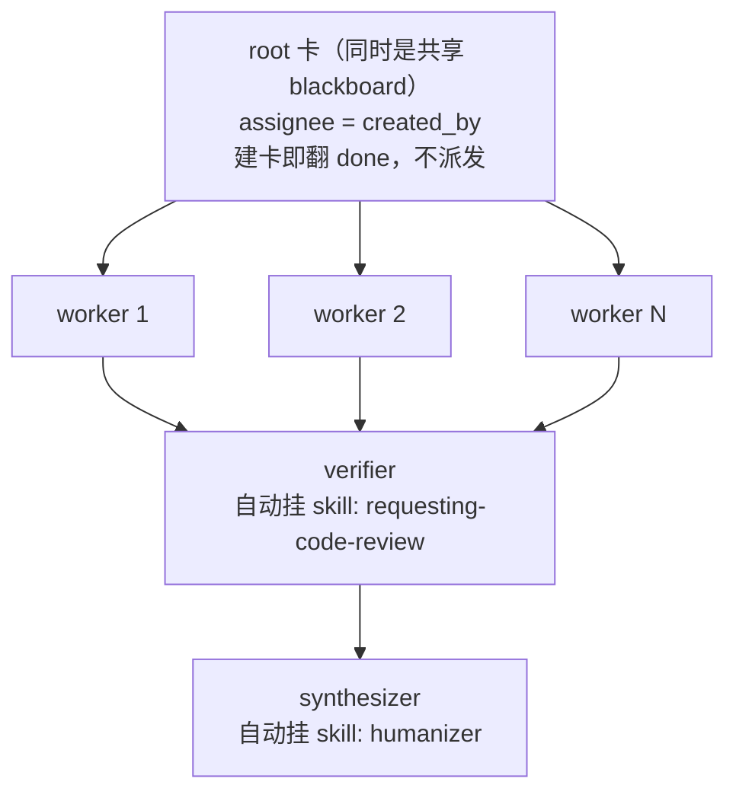
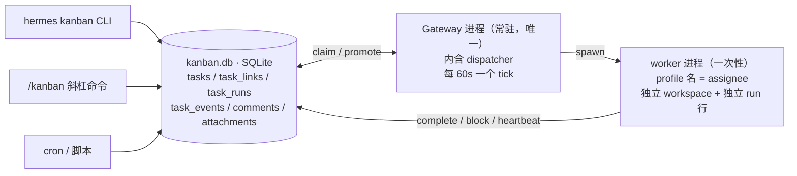
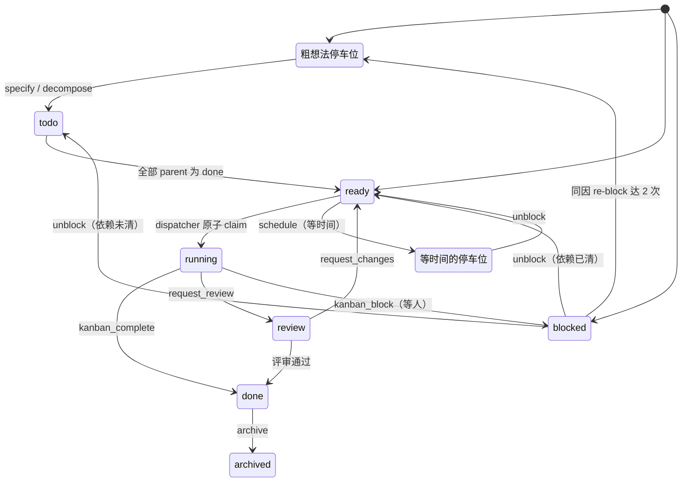
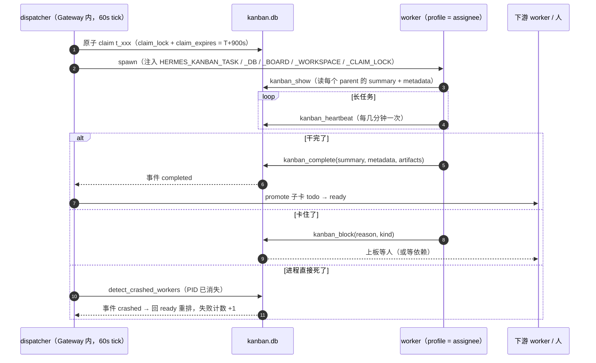

## 一、问题背景：当「派个子 agent」不再够用

*上图：一张 root 卡、N 张并行 worker 卡、一张 verifier、一张 synthesizer——Swarm 的全部结构就这么多。*

如果你写过稍微复杂一点的 agent 系统，大概都撞过同一堵墙。

`delegate_task` 这类工具的模型很干净：父 agent 发起一次调用，子 agent 在隔离上下文里干完，把结论塞回来，父 agent 接着跑。这是一次 **RPC 调用**——fork 和 join 之间，父 agent 是阻塞的。

只要子任务是「给我一个短推理答案」，这套模型完美。但下面这些情况会让它当场失效：

- 任务要跑 40 分钟，中途你关掉了终端；
- 子 agent 在第 30 分钟崩了，你想从断点续跑，而不是从头再来；
- 你得先看一眼它的中间结论，确认方向没跑偏，再让它继续；
- 你想让 A 写完、B 来审、审不过退回给 A 改——而 A 可能已经不在上下文里了；
- 一周后你想知道「这个结论当初是谁定的、依据是什么」。

这些需求有个共同点：**它们都要求「交接」这件事本身被持久化成一个可以被看见、被编辑、被别人接手的东西**。而函数调用栈天生做不到这件事——上下文一压缩，审计链就没了。

Hermes Agent 的 Kanban 就是冲着这个缺口去的。它往 SQLite 里写一张任务板，让**每个交接都是一行任何 profile（或人）都能读、能改的记录**。

而 Kanban Swarm，是这张板子上的一层「薄拓扑 helper」——一条命令把一支多智能体流水线搭出来。

> **版本说明（请先读这一段）**
> 本文所有实测结论的基线是 **Hermes Agent v0.20.0（2026.8.3）**，即本机安装版。
> 需要澄清一个常见误解：**Kanban Swarm 不是 v0.20 的新特性**。`hermes_cli/kanban_swarm.py` 的首次提交在 **2026-05-18**，比 v0.20.0 早两个半月；v0.20.0 的 release notes 全文检索 `swarm` 命中 0 次，那一版与 Kanban 的真实关联是「把 Kanban 作为桌面插件 SDK 的首个示例插件」。当前官方最新版是 v0.21.3（tag `v2026.9.14`）。故本文标题不带版本号——「某版本引入了 Swarm」这个说法本身站不住。

## 二、Kanban Swarm 是什么

官方文档把它定义得很克制：`swarm` 子命令「一把创建一个持久的 **Kanban Swarm v1** 图：一张已完成的 root/blackboard 卡、N 张并行 worker 卡、一张 gate 在所有 worker 之上的 verifier 卡、一张 gate 在 verifier 之上的 synthesizer 卡」（原文为英文，此处为译文）。

源码 docstring 里有句话点破了设计哲学。以下引自本机 v0.20.0 的 `hermes_cli/kanban_swarm.py` 第 3–4 行：

> *This module intentionally does not introduce a second scheduler. It writes a small task graph into the existing Kanban kernel.*

**没有第二个调度器**。Swarm 不引入新进程、新队列、新状态；它只是往已有的 Kanban kernel 里写了一张小的 task graph，然后让原有的 dispatcher 去跑。

同一个 docstring 还把 blackboard 的设计讲透了：

> *The shared blackboard is also deliberately low-tech: structured JSON comments on the root task. That keeps all state in existing task_comments/task_events rows, so the dashboard, notifier, slash command, and dispatcher keep working without a new service.*

题眼是：**把状态放进已有的表，而不是新起一个服务**。

这一点为什么重要？因为它意味着 Swarm 继承了 Kanban 全部的重试、崩溃回收、人工介入、审计能力——你不需要为「并行流水线」再学一套运维模型。代价是它也继承了 Kanban 全部的坑（第六节会讲）。

### 拓扑



几个只有读代码才知道的细节（以下全部按本机 v0.20.0 的 `hermes_cli/kanban_swarm.py` 核对过行号）：

- **root 卡不派发。** 标题默认是 `Swarm: <goal 首行截 80 字>`，建卡后立刻被 `complete_task` 标成 `done`，并写入 `metadata={"kind": "kanban_swarm_v1", "goal": ..., "worker_count": N}`。模块 docstring 的原话是「the planning root is marked `done` with topology metadata」——它完成的**唯一目的**就是让并行 worker 能立刻开跑，同时自己留作共享 blackboard 和审计锚点。
- **共享 blackboard 是 root 卡上的结构化 JSON 注释**，前缀常量 `BLACKBOARD_PREFIX = "[swarm:blackboard] "`（本机第 26 行）。最后一步 `post_blackboard_update(..., key="topology", value=...)` 把整张图的 id 连同 goal 写进去。同一个 key 后写的覆盖先写的，`latest_blackboard()` 会把胜出者记进 `_authors`，用于追溯「这个值是哪个 profile 定的」。
- **verifier 和 synthesizer 的技能是硬编码的**（本机第 192 / 211 行）：verifier 挂 `requesting-code-review`，body 里写死验收指令——证据充分才 `complete` 并带 `metadata={"gate": "pass"}`，否则 block 说明具体缺什么；synthesizer 挂 `humanizer`，body 写明「verifier 放行前不要开始」。
- **幂等靠 `--idempotency-key`。** `create_task` 带 key 命中已存在的 root 时，它读一次 `latest_blackboard()["topology"]`，恢复 worker / verifier / synthesizer 三个 id 后直接返回，不重复建图。重跑脚本不会炸出一堆重复卡。
- **没有 `kanban_swarm` 工具。** worker 工具面里不存在造 swarm 的工具——swarm 只能从 CLI／`/kanban` 斜杠命令造，或者你自己用 `kanban_create(parents=[...])` 手工搭同样的图。

> ⚠️ **一个版本差异，别被我上面的话误导**：本机 v0.20.0 是**逐张** `create_task` + 一次 `complete_task`，中间没有一个包裹全图的事务；而最新 main 分支已经把 root 的激活路径改进为单个 `write_txn`，整图原子提交。也就是说「读者要么看不到新 swarm、要么看到完整拓扑」这个原子性保证，是**新版本**才有的性质。跨版本引用时请分开说。

## 三、拓扑与生命周期

### 谁在跑 dispatcher



**dispatcher 内嵌在 gateway 进程里**（`kanban.dispatch_in_gateway` 默认 `true`），默认每 60 秒一个 tick，**一个 dispatcher 扫所有 board**。`hermes kanban daemon` 这个独立守护进程已经废弃——同库双 dispatcher 会抢 claim，不被支持。标准做法就一句 `hermes gateway start`。

为什么重要：**卡片的推进是「常驻服务里的一条 60 秒循环」，不是一次调用**。所以 `todo` 卡不需要任何人轮询就会被推进；但也正因为如此，你必须接受 claim 锁、TTL、heartbeat、熔断这一整套运维语义。没有 gateway 进程时，`hermes kanban create` 会当场警告你，而 `ready` 卡会原地不动。

### 九个状态，不是八个

官方文档「Core concepts」写的是 8 个状态。代码里是 **9 个**：

```python
# hermes_cli/kanban_db.py:102
VALID_STATUSES = {"triage", "todo", "scheduled", "ready",
                  "running", "blocked", "review", "done", "archived"}
```

多出来的是 `scheduled`——一个**等时间的停车位**。这个区分很关键：`blocked` 是等人，`scheduled` 是等时间。把它们混成一个状态，你就无法在诊断里区分「卡住了」和「还没到时候」。

另外，初始状态只有两个：`VALID_INITIAL_STATUSES = {"running", "blocked"}`。默认 `running`；要「建卡即需人工」就用 `--initial-status blocked`。



> 上图的 `running → ready` 回边画不下，单列在这里：`crashed`、`timed_out`、`reclaimed`、`stale` 四种事件都会把卡退回 `ready` 重排。

依赖语义有一个必须记牢的点：`parents` 的语义是「**全部** parent 达到 `done` 才 `todo → ready`」，不是「任一」。反方向也成立——parent 已经 `done` 时新建的子卡**直接落 `ready`**，这就是「给已完成的卡开后续修复卡」能立刻派发的原因。

`block(kind="dependency")` 是个精巧的特例：它**不落 `blocked`，而是落 `todo` 等父卡**，父卡清空后自动 promote，全程不需要人。

### 事件词汇表

状态机是给人看的，事件流是给机器看的。`hermes kanban watch` 能实时刷出这些：

| 类别 | 事件 |
|---|---|
| 生命周期 | `created` `promoted` `claimed` `completed` `blocked` `dependency_wait` `unblocked` `archived` |
| 人工编辑 | `assigned` `edited` `reprioritized` `status` |
| worker 遥测 | `spawned` `heartbeat` `reclaimed` `crashed` `timed_out` `stale` `reconciled` `respawn_guarded` `spawn_failed` `protocol_violation` `gave_up` |
| 评审 | `review_requested` `changes_requested` `review_reopened` `claim_extended` |

排障时最有用的一条命令是过滤：

```bash
hermes kanban watch --kinds completed,gave_up,timed_out,protocol_violation
```

## 四、上手实战

### 4.1 建板与手工串链

```bash
# 1) 建库（幂等）
hermes kanban init

# 2) 单独开一块板并切过去
hermes kanban boards create blog
hermes kanban boards switch blog

# 3) 建 root 卡拿 id（--json 输出里有 "id" 字段）
ROOT=$(hermes kanban create "设计多区域容灾方案" \
  --assignee orchestrator --json \
  | python -c "import json,sys;print(json.load(sys.stdin)['id'])")

# 4) fan-out：子卡挂 root（--parent 可重复）
hermes kanban create "调研现有容灾方案"      --assignee researcher --parent "$ROOT"
hermes kanban create "产出目标架构"          --assignee architect  --parent "$ROOT"
hermes kanban create "梳理故障切换演练步骤"   --assignee sre        --parent "$ROOT"

# 5) fan-in：验收卡 gate 在三张 worker 卡之上
hermes kanban create "验收容灾方案" --assignee reviewer \
  --parent <worker1> --parent <worker2> --parent <worker3>

# 6) 看板
hermes kanban list
hermes kanban show "$ROOT"
hermes kanban diagnostics          # 找结构性问题
```

这一步的 `--parent` 就是全部魔法：**它同时是依赖边和上下文通道**。子卡被派发时，`worker_context` 里会带上每个 parent 最近一次已完成 run 的 `summary` 和 `metadata`——不用你自己拼 prompt。

### 4.2 一行造全图

上面那 6 步可以用一条 `swarm` 顶掉：

```bash
hermes kanban swarm "设计多区域容灾方案" \
  --worker researcher:"调研现有容灾方案" \
  --worker architect:"产出目标架构" \
  --worker sre:"梳理故障切换演练步骤" \
  --verifier reviewer \
  --synthesizer writer \
  --created-by orchestrator \
  --idempotency-key failover-plan-2026w38 \
  --json
```

**这是实测跑通的输出**（在 v0.20.0 上原样执行）：

```json
{
  "root_id": "t_9071b888",
  "worker_ids": ["t_dc153b73", "t_a4f71b0d", "t_06428a48"],
  "verifier_id": "t_5dd391b2",
  "synthesizer_id": "t_d93c6b5b"
}
```

紧接着 `hermes kanban list` 看到的状态分布，和文档描述的拓扑完全一致：

```
✓ t_9071b888  done      orchestrator   Swarm: 设计多区域容灾方案
▶ t_dc153b73  ready     researcher     调研现有容灾方案
▶ t_a4f71b0d  ready     architect      产出目标架构
▶ t_06428a48  ready     sre            梳理故障切换演练步骤
◻ t_5dd391b2  todo      reviewer       Verify swarm outputs
◻ t_d93c6b5b  todo      writer         Synthesize swarm outputs
```

注意这里：root 是 `done`，三张 worker 是 `ready`（立刻可派发），verifier 和 synthesizer 是 `todo`（等 gate）。**一条命令，六张卡、三种状态，一次落库。**

### 4.3 worker 侧的工具面

CLI 是给人的，`kanban_*` 工具是给模型的——两套门面、同一个 DB。在 agent 自己的 run 里 fan-out 长这样：

```python
# worker 内部：三路并行调研 → 一张汇总卡
kids = []
for topic in ["现有容灾方案", "目标架构", "故障切换演练"]:
    r = kanban_create(
        title=f"调研：{topic}",
        assignee="researcher",
        parents=[MY_TASK_ID],        # 挂在自己身上，形成依赖边
        body=f"聚焦 {topic}，结论必须附来源。",
    )
    kids.append(r["id"])

kanban_create(
    title="汇总容灾方案",
    assignee="writer",
    parents=kids,                    # 全部 done 才 promote
)
```

这里有个反直觉的约束：**worker 不能给自己派活**。工具面的权限设计是——worker 只能对自己的卡做生命周期交接和附件，`unblock` 是 orchestrator 专属，`delegate_task` 的子代**不会**获得改板权限。所以上面这段代码的语义是「给别的 profile 开卡」，不是「我自己接着干」。

## 五、worker 交接与阻塞协议

一个 worker 每次被 claim，**必须且只能以四种方式之一收尾**：

| 终止器 | 落点 | 语义 |
|---|---|---|
| `kanban_complete(summary, metadata, artifacts)` | `done` | 干完了，交出手 |
| `kanban_request_review` | `review` | 干完了，但要人/评审者过目 |
| `kanban_request_changes` | 回路给原实现者 | 评审者裁决（新版本才有） |
| `kanban_block(reason, kind)` | `blocked` / `todo` | 卡住了，等人或等依赖 |

什么都不调就正常退出 = 协议违规，走崩溃路径（见第六节坑 4）。

### 三个字段的语义差别

- **`summary`**：人读交接。落在 run 行，下游子卡在 `worker_context` 里看到。**写 1–3 句人类能读懂的话**，别写 JSON。
- **`result`**：短日志行，落在 task 行。legacy 字段，为兼容保留。
- **`metadata`**：自由 JSON dict，落在 run 行，子卡看到序列化后的它。够回答四个问题就行：**改了什么 / 怎么验证的 / 什么能解锁或重试 / 还剩什么风险**。

推荐的形状（**是约定，不是 schema**）：

```python
kanban_complete(
    summary="把 swarm 拓扑写进 kanban_swarm.py，并补了 blackboard 合并逻辑。",
    metadata={
        "changed_files": ["hermes_cli/kanban_swarm.py"],
        "verification": "pytest -q tests/test_kanban_swarm.py → 12 passed",
        "dependencies": ["需 kanban_db.write_txn 支持嵌套事务"],
        "residual_risk": "同 key 覆盖语义未在并发下压测",
    },
    artifacts=["docs/swarm-topology.png"],   # 绝对路径
)
```

**禁止**把 secret、token、原始日志、PII 放进 `summary` 或 `metadata`——run 行是永久保留的。

### 一条 bulk 禁令

`hermes kanban complete` 的 `--help` 原文写得很直接：

```
task_ids     One or more task ids (only --result applies to all of them)
```

也就是说**批量 close 只能共用 `--result`，不能共用 `--summary`**。理由是交接是 per-run 的——把同一份 summary 复制到 N 张卡上几乎总是错的。想省事的话，工具面里根本没有 bulk 变体。

### 附件与工作区

- `kanban_attach`（base64）/ `kanban_attach_url`（服务端抓取），**单文件 25MB 上限**，落在 `<hermes-kanban-root>/attachments/<task_id>/`。worker 上下文里拿到的是**绝对路径**——本地 terminal 后端可直接读；Docker/Modal 后端得自己挂载那个目录。
- 工作区三种 `kind`：`scratch`（默认，**完成即删**）、`dir:<绝对路径>`（保留）、`worktree`（保留）。相对路径在 dispatch 时会被拒，这是 confused-deputy 防护。
- ⚠️ **正因为 `scratch` 完成即删，`artifacts=[...]` 里的路径必须真实存在**：声明的文件会在清理前被拷进 per-task attachment 存储；声明的路径不存在，卡会被留在 in-flight 让你改路径重试。

### 一次完整的交接时序



## 六、排障与坑

这一节是全文最值钱的部分——**坑 1 和坑 2 是我这次实测踩出来的，不是转述**。

### 坑 1：官方文档的 swarm 示例是错的，照抄会报错

文档里写的是：

```bash
# ❌ 文档原文 —— 跑不通
hermes kanban swarm "Design a multi-region failover plan" \
  --workers researcher,architect,sre \
  --verifier reviewer --synthesizer writer
```

`--workers` 这个 flag **在代码里不存在**。parser 只接受**单数、可重复**的 `--worker PROFILE:TITLE[:SKILL,SKILL]`。实测 `hermes kanban swarm --help` 的输出：

```
--worker PROFILE:TITLE[:SKILL,SKILL]
                      Parallel worker card (repeatable)
--verifier VERIFIER   Verifier profile
--synthesizer SYNTHESIZER
                      Synthesizer/writer profile
```

照抄文档会直接吃 argparse 的「unrecognized arguments」。正确写法见 4.2 节。

顺带一个未验证的边界：`[:SKILL,SKILL]` 里的技能名只是透传给建卡，代码**不校验其是否存在**，也没有运行时安装。写错不会报错，只会让 worker 静默缺少该技能。

### 坑 2：在 worker 会话里跑 CLI，`HERMES_KANBAN_DB` 会压过 `--board`

这是我这次踩得最狠的一个。我本想开一块临时板做验证，于是：

```bash
hermes kanban boards create swarm-verify-tmp
hermes kanban --board swarm-verify-tmp swarm "设计多区域容灾方案" \
  --worker researcher:"..." --worker architect:"..." --worker sre:"..." \
  --verifier reviewer --synthesizer writer --json
```

`boards create` 打印出来的 DB 路径就有点不对劲：

```
Board 'swarm-verify-tmp' created.
  DB path:      ...\kanban\boards\blog\kanban.db      # ← 这是 blog 板的库！
```

随后 `hermes kanban --board swarm-verify-tmp list` 里，**blog 板的任务和新造的 swarm 卡混在了一起**。

根因在环境变量上。dispatcher 给每个 worker 注入了一整套 `HERMES_KANBAN_*`：

```
HERMES_KANBAN_DB=...\boards\blog\kanban.db
HERMES_KANBAN_BOARD=blog
HERMES_KANBAN_WORKSPACES_ROOT=...\boards\blog\workspaces
```

**`HERMES_KANBAN_DB` 的优先级高于 `--board`。** 所以在 worker 会话里，无论你 `--board` 写了什么，写的都是**当前这块板**。我用它验证代码块是对的（输出确实是我想要的那六个 id），但代价是那六张卡落进了生产板——我随后 `hermes kanban archive` 把它们逐张清掉了。

正确姿势有两种：

```bash
# 方式 A：显式清掉钉死的环境变量（回到「普通 shell」的解析逻辑）
env -u HERMES_KANBAN_DB -u HERMES_KANBAN_BOARD \
    -u HERMES_KANBAN_WORKSPACES_ROOT \
    hermes kanban --board swarm-verify-tmp list

# 方式 B：干脆别在 worker 里做跨板操作——跨板验证放到宿主机 shell 做
```

清掉之后 `hermes kanban boards list` 才恢复成每块板各自的计数，各自独立：

```
SLUG              NAME                COUNTS
default           Default             done=1
● blog            技术博客工作板        done=2, running=1, todo=2
swarm-verify-tmp  Swarm Verify Tmp    (empty)
```

**结论**：板间隔离本身是真实存在的（每块板独立 DB、独立 `workspaces/`、独立 `logs/`），但**在 worker 上下文里，环境变量的优先级会绕过它**。做跨板操作前先 `env | grep -i kanban` 看一眼。

（另外记一条副作用：`boards rm <slug>` 的默认行为不是删除，而是**归档到 `boards/_archived/<slug>-<时间戳>/`**，把目录移回去就能恢复。所以清理临时板不必上 `--delete`。）

### 坑 3：卡在 `ready` 不动

两个最常见原因：

- **没有 dispatcher 在跑。** `kanban.dispatch_in_gateway` 默认 `true`，但 gateway 进程得活着。`hermes kanban create` 会检测并警告，别忽略那个警告。
- **assignee 不存在。** 我实测过：`hermes kanban create "x" --assignee __probe_no_such_profile__ --json` 返回的 `status` 是 `ready`——**建卡不会校验 assignee**。dispatcher 在下一个 tick 会静默跳过它（诊断里记 `skipped_nonspawnable`），卡就永远躺在 `ready`。

排查顺序：`hermes kanban assignees` 看已装 profile → `hermes kanban diagnostics` 看有没有 `stranded_in_ready`（阈值默认 30 分钟，2× 升 error、6× 升 critical）。

### 坑 4：任务「成功退出」了，但被熔断

worker 以 0 退出、却**没有调用任何一种终止器**，会产生 `protocol_violation` 事件。连续违规上限是 **3 次**，达到才 `gave_up` + 自动 block。

这个设计很讲究：只计**连续**违规——中间被限流重排算中性，其它类型的失败会清零连击。所以偶发的模型抽风不会熔断你，但一个结构性 bug（比如工具调用永远抛异常）会被准确定位。

### 坑 5：长任务被误判成 stale

常量先记住：`DEFAULT_CLAIM_TTL_SECONDS = 15 * 60`（900 秒），stale 阈值 `dispatch_stale_timeout_seconds = 14400`（4 小时）。

**但 TTL 过期 ≠ 立刻回收。** 只有 worker 进程真的死了才回收；活着的 worker 拿到的是 **claim 续期**（`claim_extended`），不是被杀。典型反例是一个没有 tool call 的长 LLM 调用耗了 20 多分钟——它不会被误杀。

真正会触发 `stale` 的条件是：跑超 4 小时 **且** 最近 1 小时没有 `kanban_heartbeat`。此时 dispatcher 终止本机 worker、卡回 `ready`，事件 `stale` 带 `{elapsed_seconds, last_heartbeat_at, heartbeat_age_seconds, pid, terminated}`，**且不计失败计数**——因为这是 dispatcher 侧的缺席检测，不是 worker 的错。

所以：**长任务请调 `kanban_heartbeat`**，每几分钟一次。

### 坑 6：block → unblock 的无限循环

断路器 `BLOCK_RECURRENCE_LIMIT = 2`。同一个原因反复 block → unblock → re-block 到上限后，任务**不再回 `blocked`**，而是改送 `triage` 等人来编排。事件 `block_loop_detected`。

这个机制专治「cron 无限 unblock」——没有它，一个写坏的定时任务能把板子刷爆。计数器只在**成功 `complete`** 时复位。

### 坑 7：文档说 8 个状态，代码里 9 个

小坑，但别照抄「8 个状态」然后说这就是全部——`scheduled` 确实在 `VALID_STATUSES` 里。同类问题还有一处：文档正文写「eight canonical collaboration patterns」，但同一段落的表格实际列了 **P1–P9 共 9 行**。数字对不上时，信代码。

### 一张排障速查表

| 现象 | 事件 | 处置 |
|---|---|---|
| 卡在 ready 不动 | （无）`skipped_nonspawnable` | 检查 assignee 是否已装 profile / dispatcher 是否在跑 |
| spawn 连续失败 | `spawn_failed` × N → `gave_up` | 看 error 字段；`--max-retries N` 可调（N=1 = 零重试） |
| 正常退出但没交接 | `protocol_violation` × 3 → `gave_up` | 检查 worker 有没有调终止器 |
| 跑太久没心跳 | `stale` | 加 `kanban_heartbeat`；或调 `dispatch_stale_timeout_seconds` |
| 崩溃在 claim 中途 | `crashed` / `reconciled` | 自动回 ready；`reconcile_orphans` 默认 true 兜底 |
| 反复 block 同一原因 | `block_loop_detected` | 任务已送 triage，需要人编排 |
| 一小时内刚成功过又被重生 | `respawn_guarded` | 合理：等评审，不是 bug |
| 卡在 review 但子卡还在等 | 诊断 `review_dependency_deadlock` | 完成已完成的阶段，或解除错误的边 |

## 七、适用边界与对比

### Kanban vs `delegate_task`

官方原文给的对照表，直接可用：

| | `delegate_task` | Kanban |
|---|---|---|
| 形状 | RPC 调用（fork → join） | 持久消息队列 + 状态机 |
| 父 agent | 阻塞直到子 agent 返回 | `create` 之后即走即忘 |
| 子任务身份 | 匿名 subagent | 具名 profile，带持久记忆 |
| 可恢复性 | 无——失败就是失败 | block → unblock → 重跑；崩溃 → reclaim |
| 人在环路 | 不支持 | 任意时刻 comment / unblock |
| 一个任务上的 agent 数 | 一次调用 = 一个 subagent | 一个任务的生命周期内可有 N 个（重试、评审、后续） |
| 审计链 | 上下文压缩即丢失 | SQLite 里的持久行，永久保留 |
| 协作形态 | 层级式（调用者 → 被调用者） | 对等式——任何 profile 可读写任何任务 |

一句话区分：**`delegate_task` 是一次函数调用；Kanban 是一个工作队列，每个交接都是一行任何 profile（或人）都能看见、能编辑的记录。**

两者是共存的，不是替代关系：**kanban worker 在自己的 run 内照样可以调 `delegate_task`**。判据很清晰——

- 用 `delegate_task`：父 agent 继续往下走之前需要一个**短推理答案**，不需要人工介入，结果回父上下文。
- 用 Kanban：**跨 agent 边界**，需要跨重启存活，可能需要人工输入，可能被另一个角色接手，事后需要可发现。

### 什么时候不该用板

- **单机跨主机共享板不支持。** Kanban 刻意做成单机：`kanban.db` 是本地 SQLite，dispatcher 在同一台机器上 spawn worker，崩溃检测假设 PID 是本机的。想跨机器就每台一个独立板，用 `delegate_task` 或消息队列来桥接。
- **纯一次性的短推理**，`delegate_task` 更省——你不需要为 30 秒的活付出建卡、claim、交接的成本。
- **无人值守但没有持久化需求**，cron 更简单。板子的价值在「交接要被人看见」，没有这个需求时它是纯开销。

### 值得记住的五个常量

`claim TTL 900s`（`kanban_db.py:219`）/ `stale 4h`（`config_defaults.py:2378`，即 `dispatch_stale_timeout_seconds = 14400`）/ `failure_limit 2`（`kanban_db.py:6742`）/ 协议违规上限 3（`kanban_db.py:7553`）/ block 循环上限 2（`kanban_db.py:134`）。这五个常量决定了你板上任务的「脾气」；行号取自本机 v0.20.0 代码树实测，可直接跳过去求证。

---

## 结语

Kanban Swarm 真正解决的不是「怎么让多个 agent 并行」，而是**「怎么让多个 agent 的交接变成一件可以被审计、被干预、被接手的事」**。

它的克制之处在于：不引入第二个调度器，只是往已有的 Kanban kernel 里写一张小图，然后把重试、崩溃回收、人工介入、事件流全部继承下来。代价是你必须接受一整套分布式系统的运维语义——claim 锁、TTL、heartbeat、三重熔断，第六节那些坑就是入场费。

任务停留在「给我一个短答案」阶段时，`delegate_task` 就够了，别上板。但只要出现「跑几十分钟」「要人看一眼」「要换人接手」「事后要复盘」中的任何一条，这张板子就是目前最省心的答案。

---

**参考来源**

- 官方文档：[Kanban](https://hermes-agent.nousresearch.com/docs/user-guide/features/kanban) · [Swarm topology helper](https://hermes-agent.nousresearch.com/docs/user-guide/features/kanban#kanban-swarm-topology-helper) · [Worker lanes](https://hermes-agent.nousresearch.com/docs/user-guide/features/kanban-worker-lanes)
- 源码：[`hermes_cli/kanban_swarm.py`](https://raw.githubusercontent.com/NousResearch/hermes-agent/main/hermes_cli/kanban_swarm.py) · [`hermes_cli/kanban_parser.py`](https://raw.githubusercontent.com/NousResearch/hermes-agent/main/hermes_cli/kanban_parser.py)
- 实测环境：本机 Hermes Agent v0.20.0（2026.8.3），所有 CLI 示例均原样执行过
